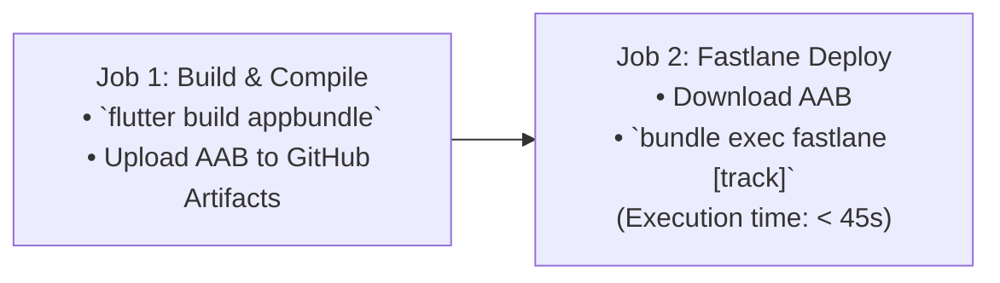

# Fastlane Performance & CI Execution Optimization Guide

This guide details optimization strategies for reducing Fastlane pipeline run times on developer machines and headless CI/CD runners.

---

## 1. Fastlane Headless Environment Flags

By default, Fastlane prints colorful ASCII banners, animations, and telemetry summaries. On CI/CD runners, these create unnecessary log noise and waste CPU cycles.

Always configure the following flags in CI environment variables:

```yaml
env:
  CI: 'true'
  FASTLANE_SKIP_UPDATE_CHECK: '1'       # Skips checking RubyGems for newer Fastlane versions
  FASTLANE_HIDE_CHANGELOG: '1'          # Suppresses terminal changelog prints
  FASTLANE_DISABLE_ANIMATION: '1'       # Disables ANSI spin animations
  FASTLANE_OPT_OUT_USAGE: '1'           # Disables Fastlane telemetry reporting
  FASTLANE_SKIP_ACTION_SUMMARY: '1'     # Skips summary table generation on completion
```

---

## 2. Decoupled CI/CD Pipeline Architecture

Never compile binaries inside the Fastlane deployment step. Decouple compilation from distribution:



### Benefits:
1. If Google Play credentials fail or network times out, you do not need to recompile the Flutter app bundle.
2. Build artifacts are archived independently with cryptographic integrity checks.
3. Fastlane runner only requires Ruby, Bundler, and the small compiled `.aab` (no Flutter or Android SDK required in the deploy job!).

---

## 3. Selective Skipping Flags in `upload_to_play_store`

Uploading large screenshots and store metadata on every commit adds 2–4 minutes of API latency. Always skip redundant uploads:

```ruby
upload_to_play_store(
  track: "internal",
  aab: "app-release.aab",
  skip_upload_apk: true,              # Skip legacy APKs
  skip_upload_metadata: true,         # Only true when updating descriptions
  skip_upload_images: true,           # Skip icons & feature graphics
  skip_upload_screenshots: true,      # Skip screenshots
  skip_upload_changelogs: false       # Only upload release notes
)
```

---

## 4. Parallel Image Uploads with `sync_image_upload`

When updating screenshots across multiple device types (phone, 7-inch, 10-inch) and locales (`en-US`, `bn-BD`), sequential uploading can take 5+ minutes.

```ruby
lane :upload_graphics do
  upload_to_play_store(
    skip_upload_apk: true,
    skip_upload_aab: true,
    skip_upload_metadata: true,
    skip_upload_images: false,
    skip_upload_screenshots: false,
    sync_image_upload: false          # Uploads images in parallel batches
  )
end
```
