# Fastlane Supply & Google Play Store Reference Guide

This document provides in-depth reference documentation for automating Google Play Store publishing with Fastlane's `upload_to_play_store` (`supply`) action.

---

## 1. Google Play Console & GCP Service Account Setup

To enable Fastlane to communicate with Google Play Developer API v3, configure service account authentication:

### Step 1: Enable Google Play Android Developer API in Google Cloud
1. Navigate to the [Google Cloud Console](https://console.cloud.google.com/).
2. Select or create the Google Cloud project linked to your Google Play Console account.
3. Enable the **Google Play Android Developer API** (`androidpublisher.googleapis.com`).

### Step 2: Create a Service Account & Private Key
1. Go to **IAM & Admin** > **Service Accounts**.
2. Click **Create Service Account** (e.g. `fastlane-deployer@your-project.iam.gserviceaccount.com`).
3. Grant the role **Service Account User**.
4. Click on the created service account > **Keys** tab > **Add Key** > **Create new key** > Select **JSON**.
5. Save the downloaded JSON key file securely (e.g. `pc-api-key.json`).

### Step 3: Link Service Account in Google Play Console
1. Open [Google Play Console](https://play.google.com/console) > **API access**.
2. Locate the linked service account and click **Manage Play Console permissions** (or **Grant access**).
3. Grant the following permissions:
   - **Releases**:
     - *Release to production, exclude devices, and use Play App Signing*
     - *Release apps to testing tracks*
     - *Manage testing tracks and edit tester lists*
   - **Store presence**:
     - *Manage store presence* (if uploading metadata, descriptions, screenshots)
4. Click **Invite user** or **Save changes**.

> [!IMPORTANT]
> **The Initial Release Rule**: Google Play Developer API v3 strictly prohibits creating a new app or uploading the very first APK/AAB via API. The first release of an app **must be manually uploaded** via the Google Play Console web interface. After that first upload is saved, all subsequent releases, metadata updates, and track promotions can be executed headlessly via Fastlane.

---

## 2. Complete `upload_to_play_store` Parameter Specification

| Parameter | Type | Default | Description |
| :--- | :--- | :--- | :--- |
| `package_name` | String | `Appfile` | Application ID / Package Name (e.g., `com.company.impulse_app`). |
| `track` | String | `'production'` | Target release track: `'internal'`, `'alpha'`, `'beta'`, `'production'`. |
| `track_promote_to` | String | `nil` | Target track when promoting an existing release without rebuilding. |
| `rollout` | String | `nil` | Staged rollout fraction as a string: `'0.10'` (10%), `'0.25'` (25%), `'0.50'` (50%), `'1.0'` (100%). |
| `release_status` | String | `'completed'` | Status: `'completed'`, `'draft'`, `'inProgress'` (staged rollout), `'halted'`. |
| `aab` | String | `nil` | Relative or absolute path to `.aab` bundle file. |
| `aab_paths` | Array | `nil` | Multiple AAB paths if uploading split bundles. |
| `apk` / `apk_paths` | String/Array | `nil` | Path(s) to APK file(s) (prefer AAB). |
| `mapping_paths` | Array | `nil` | ProGuard/R8 de-obfuscation mapping files (`build/app/outputs/mapping/release/mapping.txt`). |
| `native_debug_symbol_paths` | Array | `nil` | ZIP archives containing unstripped native C/C++ `.so` debug symbols (required for crash de-symbolication). |
| `json_key` | String | `nil` | Path to Google Play service account JSON key file. |
| `json_key_data` | String | `ENV['...']` | Raw JSON string content of service account credentials (in-memory, no disk write). |
| `changes_not_sent_for_review` | Boolean | `false` | When `true`, submits changes directly when Play Console Managed Publishing is active. |
| `check_superseded_tracks` | Boolean | `false` | Validates whether an older version in a superseded track needs to be retained. |
| `version_code` | Integer | `nil` | Specific version code to target for promotion or update. |
| `version_name` | String | `nil` | Display version name associated with the release. |
| `skip_upload_apk` | Boolean | `false` | Skip APK binary upload. |
| `skip_upload_aab` | Boolean | `false` | Skip AAB binary upload. |
| `skip_upload_metadata` | Boolean | `false` | Skip text metadata (title, short/full descriptions). |
| `skip_upload_changelogs`| Boolean | `false` | Skip release notes upload. |
| `skip_upload_images` | Boolean | `false` | Skip icons and feature graphics upload. |
| `skip_upload_screenshots` | Boolean| `false` | Skip phone, 7-inch, and 10-inch screenshot uploads. |
| `validate_only` | Boolean | `false` | Validates the transaction with Google Play API without committing changes. |
| `sync_image_upload` | Boolean | `false` | Uploads images synchronously to prevent rate limit timeouts on large batches. |

---

## 3. Play Store Release Tracks & Promotion Topology

```mermaid
graph LR
    Build["Release AAB<br/>+ Native Symbols"] --> Internal["Internal Testing Track<br/>(Immediate QA availability, max 100 testers)"]
    Internal -->|Promote| Alpha["Closed Testing (Alpha)<br/>(Company testing pool)"]
    Alpha -->|Promote| Beta["Closed Testing (Beta)<br/>(20+ opted-in testers / 14 days)"]
    Beta -->|Promote 10% Rollout| Prod_10["Production 10%<br/>(Monitor ANRs & Crashes)"]
    Prod_10 -->|Promote 25%| Prod_25["Production 25%"]
    Prod_25 -->|Promote 50%| Prod_50["Production 50%"]
    Prod_50 -->|Promote 100%| Prod_100["Production 100%<br/>(Full Global Distribution)"]
```



### Promotion Without Recompiling
Promote releases directly across tracks using Fastlane without having to re-build or re-sign binaries:

```ruby
lane :promote_beta_to_prod do |options|
  rollout = options[:rollout] || "0.10"
  upload_to_play_store(
    track: "beta",
    track_promote_to: "production",
    rollout: rollout,
    skip_upload_aab: true,
    skip_upload_apk: true,
    skip_upload_metadata: true,
    skip_upload_images: true,
    skip_upload_screenshots: true,
    changes_not_sent_for_review: true
  )
end
```

---

## 4. Metadata Hierarchy & Enforced Character Constraints

```
android/fastlane/metadata/android/
├── en-US/
│   ├── title.txt                  # <= 30 characters (Google Play Title)
│   ├── short_description.txt      # <= 80 characters (Promo / snippet)
│   ├── full_description.txt       # <= 4000 characters (HTML formatted details)
│   ├── video.txt                  # YouTube promotional video URL
│   ├── changelogs/
│   │   ├── default.txt            # <= 500 characters (Fallback release notes)
│   │   └── <version_code>.txt     # <= 500 characters (Version-specific notes)
│   └── images/
│       ├── icon.png               # 512x512 PNG (32-bit with alpha, max 1024KB)
│       ├── featureGraphic.png     # 1024x500 PNG/JPEG (no alpha)
│       ├── promoGraphic.png       # 180x120 PNG/JPEG (optional legacy)
│       ├── tvBanner.png           # 1280x720 PNG/JPEG (Android TV only)
│       ├── phoneScreenshots/      # Min 2, max 8 screenshots (1080x1920 or 1080x2400)
│       ├── sevenInchScreenshots/  # 7-inch tablet screenshots
│       └── tenInchScreenshots/    # 10-inch tablet screenshots
└── bn-BD/
    └── ... (Bengali localized directory following identical structure)
```

---

## 5. Review Lockouts & Managed Publishing Policy

When **Managed Publishing** (formerly Timed Publishing) is activated in the Google Play Console:
1. Changes submitted with `changes_not_sent_for_review: false` (default) will be grouped into the Play Console "Ready to send for review" section and will NOT be evaluated until an administrator clicks "Submit for review".
2. Passing `changes_not_sent_for_review: true` tells Google Play to bypass the staging holding area and queue the release directly for policy review.
3. If an existing release is in the **In review** state on a target track, attempting to push a new release to that same track will fail with `Google Api Error: 400 Bad Request - Changes cannot be sent for review while an existing review is pending`. Remediate by cancelling the pending review or waiting for review approval before pushing updates.
