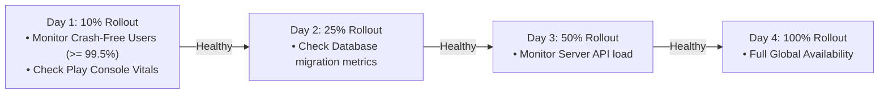

# Staged Rollout Management & Emergency Rollback Playbook

This playbook provides protocols for managing Google Play staged rollouts ($10\% \to 25\% \to 50\% \to 100\%$), halting compromised releases, and issuing emergency hotfixes via Fastlane.

---

## 1. Staged Rollout Progression Schedule

Staged rollouts allow distributing an update to a fraction of users while monitoring crash rates (Firebase Crashlytics, Google Play Vitals), ANRs, and customer feedback.



### Fastlane Rollout Lane

```ruby
# android/fastlane/Fastfile

desc "Update staged rollout fraction for production release"
lane :update_rollout do |options|
  fraction = options[:fraction] || "0.25"
  
  upload_to_play_store(
    track: "production",
    rollout: fraction.to_s,
    skip_upload_apk: true,
    skip_upload_aab: true,
    skip_upload_metadata: true,
    skip_upload_images: true,
    skip_upload_screenshots: true,
    changes_not_sent_for_review: true
  )
  
  UI.success("🚀 Google Play production staged rollout updated to: #{fraction.to_f * 100}%")
end
```

Command usage:
```bash
cd android
bundle exec fastlane update_rollout fraction:0.25
bundle exec fastlane update_rollout fraction:0.50
bundle exec fastlane update_rollout fraction:1.0
```

---

## 2. Halting a Rollout (Emergency Stop)

If a critical bug or data corruption issue is discovered during a staged rollout, you cannot "downgrade" users who have already updated. However, you MUST immediately halt further distribution to prevent more users from receiving the broken build.

### Fastlane Action: Halting a Release

```ruby
desc "Emergency halt of active Google Play staged rollout"
lane :halt_rollout do
  upload_to_play_store(
    track: "production",
    release_status: "halted",
    skip_upload_apk: true,
    skip_upload_aab: true,
    skip_upload_metadata: true,
    skip_upload_images: true,
    skip_upload_screenshots: true,
    changes_not_sent_for_review: true
  )
  
  UI.error("🛑 EMERGENCY: Google Play production staged rollout has been HALTED!")
  
  if ENV["SLACK_URL"]
    slack(
      message: "🛑 Production staged rollout was HALTED due to critical issue report.",
      channel: "#mobile-alerts",
      success: false
    )
  end
end
```

Command usage:
```bash
cd android
bundle exec fastlane halt_rollout
```

---

## 3. Hotfix Release Protocol After Rollout Halt

Once a rollout is halted:
1. **Identify Root Cause**: Diagnose the issue using `git log` and error reports.
2. **Increment Version & Build Code**: Bump version in `pubspec.yaml` (e.g. `1.0.9+10` $\to$ `1.0.10+11`).
3. **High-Priority In-App Update**: Set `in_app_update_priority: 5` in Fastlane so clients prompt immediate update on launch.
4. **Deploy Hotfix directly to 100% or fast staged rollout**:
   ```ruby
   lane :deploy_hotfix do
     upload_to_play_store(
       track: "production",
       aab: "../build/app/outputs/bundle/release/app-release.aab",
       mapping_paths: ["../build/app/outputs/mapping/release/mapping.txt"],
       update_priority: 5, # Critical immediate in-app update priority
       rollout: "1.0",     # Supersedes halted build globally
       changes_not_sent_for_review: true
     )
   end
   ```

---

## 4. Apple App Store Phased Release Pause

For iOS App Store phased releases (`phased_release: true`), pause the rollout in Fastlane or App Store Connect:
- Day 1: 1%, Day 2: 2%, Day 3: 5%, Day 4: 10%, Day 5: 20%, Day 6: 50%, Day 7: 100%.
- To pause via App Store Connect: Go to App Version > Click **Pause Phased Release**.
- You have up to 30 days to resolve the issue or push a hotfix build.
